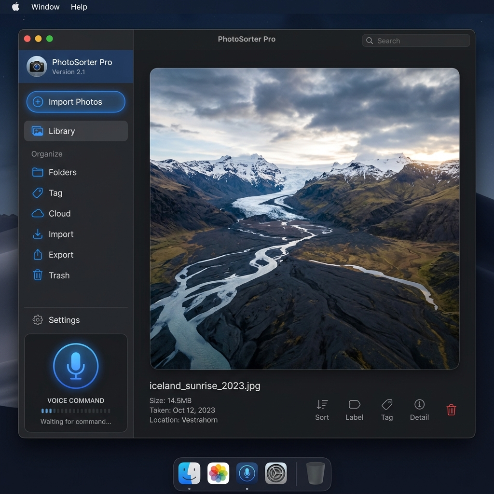

# PhotoSorter Pro 📸🎙️



Une application de bureau Python moderne et interactive pour trier, organiser et gérer vos photos intelligemment, au clavier ou à la voix. Conçue pour une efficacité maximale sans compromettre l'intégrité de vos fichiers (métadonnées et qualité).

---

## 🌟 Fonctionnalités Principales

*   **Tri Automatique par Date :** Scanne vos photos et les déplace dans une arborescence claire `yyyy/yyyy-mm-dd [Libellé]` basée sur la date de prise de vue réelle.
*   **Détection Intelligente (Appareil & WhatsApp) :** Utilise une méthode en cascade pour récupérer la date : métadonnées EXIF en priorité, puis expression régulière (regex) sur le nom du fichier (ex: WhatsApp `IMG-20230101-WA...`), et enfin la date de création du système.
*   **Classement Thématique Interactif :** Lorsqu'une nouvelle date est détectée, l'application se met en pause et vous demande (au clavier ou à la voix) un libellé pour l'événement (ex: `Soirée Jeux`, le dossier deviendra `2020-10-26 Soirée Jeux`).
*   **Intégrité Absolue des Données :** Utilise `piexif` pour extraire et réinjecter les métadonnées originales (Appareil, GPS, Date) lors du déplacement ou de la rotation. La date système (atime/mtime) est rigoureusement préservée via `os.utime`.
*   **Interface Moderne & Suivi visuel :** Construit avec `customtkinter` en mode sombre. L'application gère le redimensionnement fluide des images via `Pillow` et affiche en temps réel le dossier de destination actif, avec une barre de progression de session.
*   **Contrôle Vocal Mains-Libres :** Activez le micro et triez à la voix avec des commandes naturelles et souples (utilisation de Regex pour la détection : "garder", "sauvegarder", "ok", "okay", "supprimer", "corbeille", "rotation", "tourner", "annuler").
*   **Non-Destructif :** Les originaux traités sont archivés dans `_archive_traitee` et les refus vont dans `_corbeille_tri`. **Rien n'est supprimé définitivement.**
*   **Historique et Annulation :** Un appui sur `Ctrl+Z` (ou commande vocale "Annuler") restaure l'image et défait la dernière action grâce à un système de pile d'historique.

---

## ⚙️ Architecture Technique & Dépendances

PhotoSorter Pro (v1.8.0) est développé avec une architecture claire séparant l'UI, le traitement d'image, et le thread d'écoute vocale :

*   **UI/Framework :** `customtkinter` (Interface utilisateur moderne et responsive).
*   **Moteur d'Image :** `Pillow` (PIL) pour le redimensionnement dynamique (`min(ratio_w, ratio_h)`) sans distorsion, et `ImageOps` pour la gestion native de l'orientation.
*   **Métadonnées :** `piexif` pour manipuler les blocs binaires EXIF de manière sûre.
*   **Moteur Vocal :** `SpeechRecognition` (Google API) fonctionnant dans un `Daemon Thread` isolé pour ne pas bloquer l'interface graphique.
*   **Audio :** `PyAudio` pour la capture du microphone.
*   **Concurrency :** Communication asynchrone et thread-safe du `Thread Vocal` vers le `Thread GUI` (Tkinter) gérée nativement via `self.after(0, ...)`.

---

## 🚀 Installation & Prérequis

### 1. Prérequis
*   **Python 3.8+** doit être installé. *(Sur Windows, n'oubliez pas de cocher "Add Python to PATH" lors de l'installation de Python).*
*   **Git** doit être installé pour pouvoir récupérer le projet. *(Téléchargeable sur [git-scm.com](https://git-scm.com/downloads) : laissez les options par défaut lors de l'installation).*

### 2. Cloner le dépôt
```bash
git clone https://github.com/Audiothor/PhotoSorter-Pro.git
cd PhotoSorter-Pro
```

### 3. Installer les dépendances
```bash
pip install customtkinter Pillow piexif SpeechRecognition PyAudio
```

> **Note pour les utilisateurs macOS :**
> Si l'installation de `PyAudio` échoue, installez d'abord `portaudio` via Homebrew :
> ```bash
> brew install portaudio
> pip install PyAudio
> ```

---

## 🎮 Guide d'Utilisation

Lancez le programme via la commande suivante :
```bash
python "PhotoSorter Pro.py"
```

1.  **Démarrage :** Cliquez sur **📁 Choisir Source** (dossier contenant vos photos en vrac) puis sur **🎯 Choisir Destination** (dossier parent cible).
2.  **Alerte "NOUVEAU DOSSIER !" :** S'il s'agit du premier événement de la date, l'action est suspendue. Tapez le nom de l'événement et appuyez sur <kbd>Entrée</kbd>.
3.  **Trier :** Utilisez l'interface, votre clavier, ou votre voix.

### ⌨️ Raccourcis Clavier
| Action | Raccourci | Description |
| :--- | :--- | :--- |
| **Garder / Classer** | <kbd>Flèche Droite (→)</kbd> | Déplace et classe la photo dans le dossier, archive l'originale. |
| **Corbeille** | <kbd>Suppr (Delete)</kbd> | Déplace la photo vers le dossier de protection `_corbeille_tri`. |
| **Rotation** | <kbd>Espace</kbd> | Fait pivoter l'image de 90° (appliqué lors de la sauvegarde). |
| **Annuler** | <kbd>Ctrl</kbd> + <kbd>Z</kbd> | Restaure la dernière photo traitée (et nettoie la cible si applicable). |

### 🎙️ Commandes Vocales
Cliquez sur **🎙 Activer la Voix** pour basculer en mode écoute continue.
| Mots qui peuvent être utilisés | Action déclenchée |
| :--- | :--- |
| `"garder"`, `"sauvegarder"`, `"ok"`, `"okay"` | Classer la photo dans le dossier en cours. |
| `"supprimer"`, `"corbeille"` | Mettre à la corbeille locale de tri. |
| `"rotation"`, `"tourner"` | Faire pivoter de 90°. |
| `"annuler"` | Défaire la dernière action. |

*(Note : Lorsque l'interface vous demande un libellé de dossier à l'oral, la prochaine phrase que vous dictez sera enregistrée comme nom de dossier).*

---

## 📁 Organisation Automatique des Fichiers

L'un des atouts majeurs de PhotoSorter Pro est la façon dont il structure automatiquement vos fichiers pour garantir un rangement propre et chronologique.

### Dans votre dossier "Source"
Le dossier contenant vos photos en vrac est préservé. Le programme déplace simplement les images traitées dans deux sous-dossiers générés automatiquement :
*   📂 `_archive_traitee/` : Contient les photos originales que vous avez choisi de **garder** et classer. Elles sont archivées ici par sécurité.
*   📂 `_corbeille_tri/` : Contient les photos que vous avez choisi de **supprimer**. C'est une "poubelle" locale que vous pourrez vider vous-même plus tard.

### Dans votre dossier "Destination"
C'est ici que votre nouvelle bibliothèque photo se construit. Le programme crée une arborescence basée sur l'année de prise de vue et l'événement.

L'arborescence finale générée ressemble à ceci :
```text
📂 [Votre Dossier Destination]
 ┣ 📂 2023
 ┃  ┣ 📂 2023-01-01 Nouvel An
 ┃  ┃  ┗ 🖼️ IMG-20230101-WA0001.jpg
 ┃  ┗ 📂 2023-05-14 Week-end Normandie
 ┃     ┣ 🖼️ DSC001.jpg
 ┃     ┗ 🖼️ DSC002.jpg
 ┗ 📂 2024
    ┗ 📂 2024-10-26 Soirée Jeux
       ┗ 🖼️ photo_1.png
```
*   **Dossier Année (`YYYY`) :** Généré automatiquement selon la date exacte de la photo.
*   **Dossier Événement (`YYYY-MM-DD [Libellé]`) :** Créé dans le dossier de l'année. Il regroupe les photos du jour sous le nom de l'événement que vous avez dicté ou tapé. Si plusieurs photos ont la même date, elles iront automatiquement dans le dossier déjà existant pour cette journée.

---

## 🧠 Sous le capot (Workflow Technique)

1. **Extraction de Date (`get_safe_date`) :** Protocole à 3 niveaux.
   - *Priorité 1* : Tag EXIF `36867` (`DateTimeOriginal`).
   - *Priorité 2* : Fallback par expression régulière (`Regex`) détectant la structure `IMG-YYYYMMDD-WAxxxx` (commun pour éviter les pertes EXIF sur les réseaux sociaux).
   - *Priorité 3* : `os.path.getctime` (Date de création de l'OS).
2. **Arborescence cible :** Crée dynamiquement `/Destination/yyyy/yyyy-mm-dd [Libellé]`.
3. **Synchronisation du Système de Fichiers (`os.utime`) :** Appliqué rigoureusement après sauvegarde/rotation de la photo pour copier à l'identique l'horodatage original (`mtime`/`atime`). L'UI préserve son propre ratio d'affichage pour éviter toute déformation pendant la preview.

---

## 📄 Licence
Ce projet est sous licence MIT - libre à vous de l'utiliser, le modifier et le distribuer.